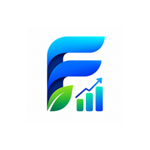

# FINOVA 💰

> **Track Money. Build Better Habits.**

FINOVA is a modern, premium Progressive Web App (PWA) for personal finance management — built to feel like a native mobile app on Android, iOS, and desktop.



---

## ✨ Features

- 📊 **Dashboard** — Balance card, income/expense/savings overview, quick actions
- 💸 **Transactions** — Add expense, income & transfers; search, filter, and timeline view
- 📈 **Reports** — Pie charts, bar charts, line charts, and calendar heatmap
- 🎯 **Goals** — Set savings goals with progress tracking and goal templates
- 💼 **Budgets** — Category-based budgets with spending progress bars and alerts
- ⚙️ **Settings** — Profile, currency, backup/restore, and about page
- 🔐 **Google Auth** — Secure sign-in via Firebase Google Authentication
- 📱 **PWA** — Installable on Android, iOS, and desktop with offline support

---

## 🚀 Tech Stack

| Layer | Technology |
|-------|-----------|
| Framework | React 18 + TypeScript |
| Build Tool | Vite |
| Styling | Tailwind CSS v4 |
| Charts | Recharts |
| Icons | Lucide React |
| Auth | Firebase Google Auth |
| Database | Supabase (localStorage fallback) |
| PWA | vite-plugin-pwa + Workbox |
| Date Utilities | date-fns |

---

## 🛠️ Getting Started

### 1. Clone the repository

```bash
git clone https://github.com/cmmanikandan/finova.git
cd finova
```

### 2. Install dependencies

```bash
npm install
```

### 3. Configure environment variables

```bash
cp .env.example .env
```

Fill in your Firebase and Supabase credentials in `.env`:

```env
VITE_FIREBASE_API_KEY=...
VITE_FIREBASE_AUTH_DOMAIN=...
VITE_FIREBASE_PROJECT_ID=...
VITE_FIREBASE_STORAGE_BUCKET=...
VITE_FIREBASE_MESSAGING_SENDER_ID=...
VITE_FIREBASE_APP_ID=...
VITE_FIREBASE_MEASUREMENT_ID=...

VITE_SUPABASE_URL=...
VITE_SUPABASE_ANON_KEY=...
```

> **Note:** Without credentials, the app runs in **Demo Mode** using localStorage — fully functional for testing.

### 4. Run the development server

```bash
npm run dev
```

Open [http://localhost:5173](http://localhost:5173) in your browser.

---

## 📦 Build for Production

```bash
npm run build
```

Output is in the `dist/` folder, ready to deploy on Vercel, Netlify, or any static host.

---

## 🔥 Firebase Setup

1. Go to [Firebase Console](https://console.firebase.google.com)
2. Create a project (or use existing)
3. Enable **Authentication** → **Google** sign-in provider
4. Add your deployment domain to **Authorized Domains** (and `localhost` for dev)
5. Copy config values to `.env`

---

## 🟩 Supabase Setup

1. Go to [Supabase Dashboard](https://supabase.com/dashboard)
2. Create a new project
3. Open **SQL Editor** and run the schema from `src/services/supabase.ts`
4. Copy the Project URL and Anon Key to `.env`

---

## 📱 PWA Installation

1. Open the app in Chrome on Android or desktop
2. Tap the **Install** prompt in the address bar
3. FINOVA installs as a standalone app with the official logo

---

## 📁 Project Structure

```
src/
├── assets/         Logo and static assets
├── components/     BottomNav, Header, TransactionForm
├── context/        AppContext (global state)
├── data/           Default categories, accounts, currencies
├── pages/          SplashScreen, LandingPage, Dashboard, Transactions, Reports, Goals, Settings
├── services/       auth.ts, db.ts, firebase.ts, supabase.ts
├── types/          TypeScript interfaces
└── utils/          format.ts, uuid.ts

public/
├── favicon.ico
├── apple-touch-icon.png
├── icon-{16..1024}x{size}.png
└── manifest icons
```

---

## 🪪 License

MIT © FINOVA
